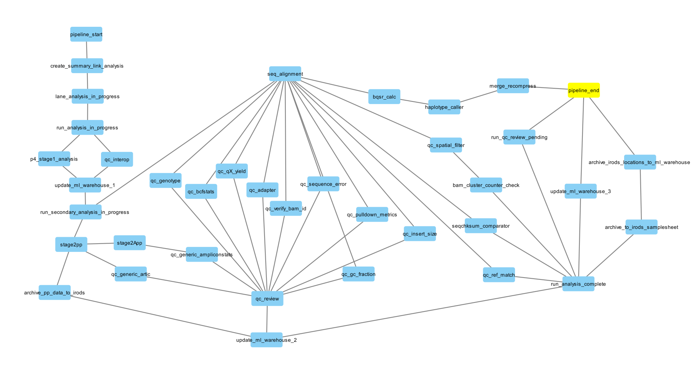
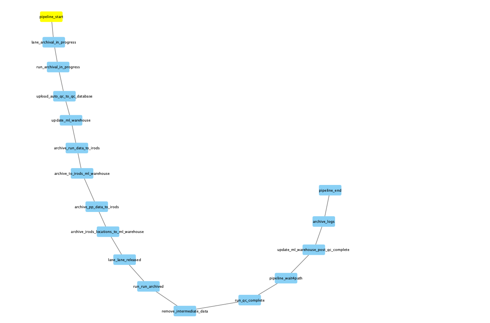

# NPG Pipelines for Processing Illumina Sequencing Data

This software provides the Sanger NPG team's automation for analysing and
internally archiving Illumina sequencing data on behalf of DNA Pipelines for
their customers.

There are two main pipelines:

* data product and QC metric creation: `central`
* internal archival of data products, metadata, QC metrics and logs:
  `post_qc_review`

and the daemons which automatically start these pipelines.

Processing is performed as appropriate for the entire run, for each lane in the
sequencing flowcell, or each tagged library (within a pool on the flowcell).

## Batch Processing and Dependency Tracking with LSF or wr

With this system, all of a pipeline's jobs for its steps are submitted for
execution to `LSF` or `wr` batch/job processing system as the pipeline is
initialised. As such, a _submitted_ pipeline does not have an orchestration
script or daemon running: managing the runtime dependencies of jobs within an
instance of a pipeline is delegated to the batch/job processing system.

How is this done? The job representing the start point of a graph is submitted
to `LSF` or `wr` in a suspended state and is resumed once all other jobs have been
submitted thus ensuring that the execution starts only if all steps are
successfully submitted. If an error occurs at any point during job submissions,
all submitted jobs, apart from the start job, are killed.

## Pipeline Creation

Steps of each of the pipelines and dependencies between the steps are defined in
JSON input files located in data/config_files directory. The files follow
[JSON Graph Format](https://github.com/jsongraph/json-graph-specification)
syntax. Individual pipeline steps are defined as graph nodes, dependencies
between them as directed graph edges. If step B should be executed after step A
finishes, step B is considered to be dependant on step A.

The graph represented by the input file should be a directed acyclic graph
(DAG). Each graph node should have an id, which should be unique, and a label,
which is the name of the pipeline step.

Parallelisation of processing may be performed at different levels within the
DAG: some steps are appropriate for

* per run
* per lane
* per lane and tagged library, or per tagged library
* per tagged library

parallelisation.

#### Visualizing Input Graphs

JSON Graph Format (JGF) is relatively new, with little support for
visualization. Convert JGF to GML
[Graph Modeling Language](http://www.fim.uni-passau.de/fileadmin/files/lehrstuhl/brandenburg/projekte/gml/gml-technical-report.pdf)
format using a simple script supplied with this package, `scripts/jgf2gml` .
Many graph visualization tools, for example
[Cytoscape](http://www.cytoscape.org/), support the GML format.

## Per Sequencing-Run Pipelines

The processing is performed per sequencing run. Many different studies and
sequencing assays for different "customers" may be performed on a single run.
Unlike contemporary (2020s) sharable bioinformatics pipelines, the logic for
informatics is tied closely to the business logic e.g. what aligner is required
with what reference, whether human read separation is required, is determined
per indexed library within a lane of sequencing and scheduled for work in
parallel.

The information required for the logic is obtained from the upstream "LIMS" via
a MLWH (Multi-LIMS warehouse) database and the run folder output by the
sequencing instrument.

### Analysis Pipeline

Processes data coming from Illumina sequencing instruments. It is labeled the
"central" pipeline.

The input for an instance of the pipeline is the instrument output run folder
(BCL and associated files) and LIMS information which drives appropriate
processing.

The key data products are aligned or unaligned CRAM files and indexes.
However per study (a LIMS datum) pipeline configuration allows for the
creation of GATK gVCF files, or the running for external tool/pipeline e.g.
ncov2012-artic-nf

Within this DAG there are two step which are key in producing the main data products:

* `p4_stage1_analysis` processes data at the lane level within a flowcell/run: includes conversion of instrument output (BCL files) to BAM format, demultiplexing of data within a lane to tagged libraries, alignment with any spiked phiX, (for some instrument types) detection of indel inducing fluidics bubbles and marking reads with fail bit, and (for some instrument types) detection and marking of sequencing adapter.
* `seq_alignment` processes data at tagged library, or lane and tagged library, level: includes alignment to the target genome (or not), a naive human read filtering capability, splitting of human target data by autosome/allosome capability, (for some instrument types) removal of marked adapter pre-alignment and pasting post-alignment (so there is no loss of instrument basecalls or quality data), duplicate marking, and creation of standard sequencing metrics files.

### Archival Pipeline

Archives sequencing data (CRAM files) and other related artifacts e.g. index
files. QC metrics. It is labeled the "post_qc_review" pipeline.

### Pipeline Script Outputs

Log file - in the run folder (as in the current pipeline). Example:
`/nfs/sf55/IL_seq_data/outgoing/path_to_runfolder/bin_npg_pipeline_central_25438_20180321-080455-2214166102.log`

File with JSON serialization of definition objects - in the analysis directory
directory. Example:
`/path_to_runfolder/bin_npg_pipeline_central_25438_20180321-080455-2214166102.log.json`

File with saved commands hashed by function name, LSF job id and array index -
in the analysis directory. Example:
`/path_to_runfolder/Data/Intensities/BAM_basecalls_20180321-075511/bin_npg_pipeline_central_25438_20180321-080455-2214166102.log.commands4jobs.json`

## Dependencies

This software relies heavily on the
[npg_tracking](https://github.com/wtsi-npg/npg_tracking) software to abstract
information from the MLWH and instrument runfolder, and coordination of the
state of the run.

This software integrates heavily with the
[npg_qc](https://github.com/wtsi-npg/npg_qc) system for calculating and
recording for internal display QC metrics for operational teams to assess the
sequencing and upstream processes.

For the data processing intensive steps, `p4_stage1_analysis` and
`seq_alignment`, the [p4](https://github.com/wtsi-npg/p4) software is used to
provide disk IO minimised processing of many informatics tools in streaming data
flow DAGs.

Also, the [npg_irods](https://github.com/wtsi-npg/npg_irods) system is essential
for the internal archival of data products.

## Data Merging across Lanes of a Flowcell

If the same library is sequenced in different lanes of a flowcell, under certain
conditions the pipeline will automatically merge all data for a library into
a single end product. Spiked-in PhiX libraries data and unassigned to any tags
data (tag zero) are not merged. The following scenarios trigger the merge:

* NovaSeq Standard flowcell - a merge across all two or four lanes is performed.

* Any flowcell run on a NovaSeqX instrument - if multiple lanes belong to the
  same pool, the data from individual libraries will be merged across those
  lanes. Thus the output of a NovaSeqX run might contain a mixture of merged and
  unmerged products.

If the data quality in a lane is poor, the lane should be excluded from the merge.
The `--process_separately_lanes` pipeline option is used to list lanes like this.
Usually this option is used when running the analysis pipeline. The pipeline caches
the supplied lane numbers so that the archival pipeline can generate a consistent
with the analysis pipeline list of data products. The same relates to the
`npg_run_is_deletable` script. The cached value is retrieved only if the
`--process_separately_lanes` argument was not set when any of these scripts are
invoked.

